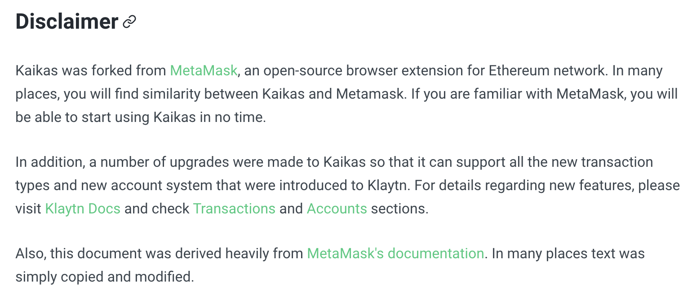
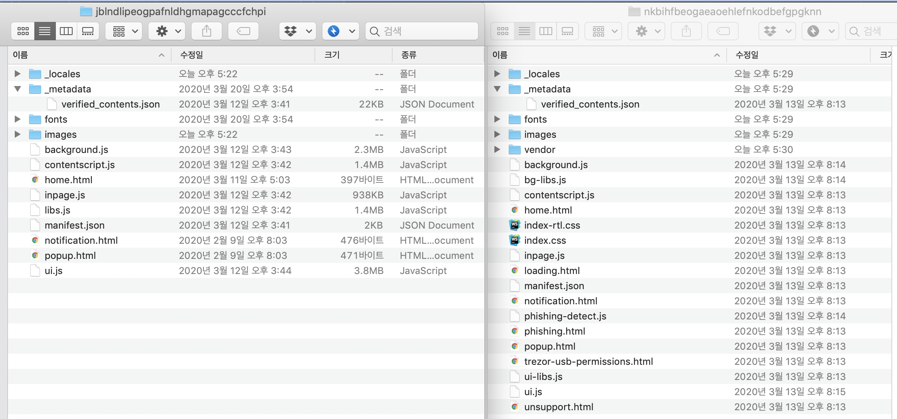
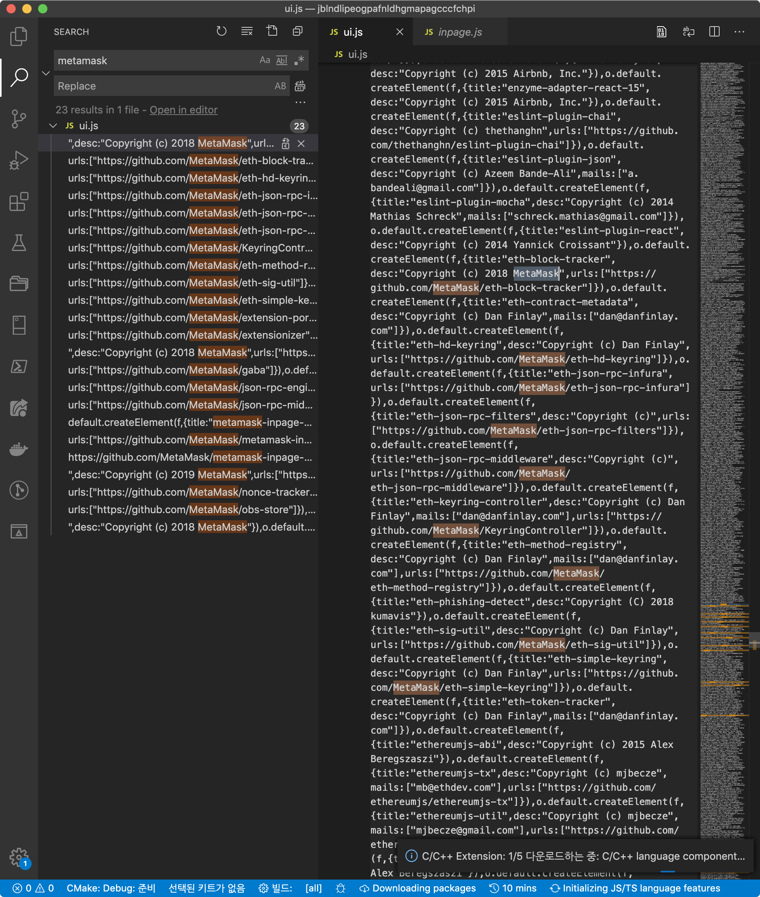
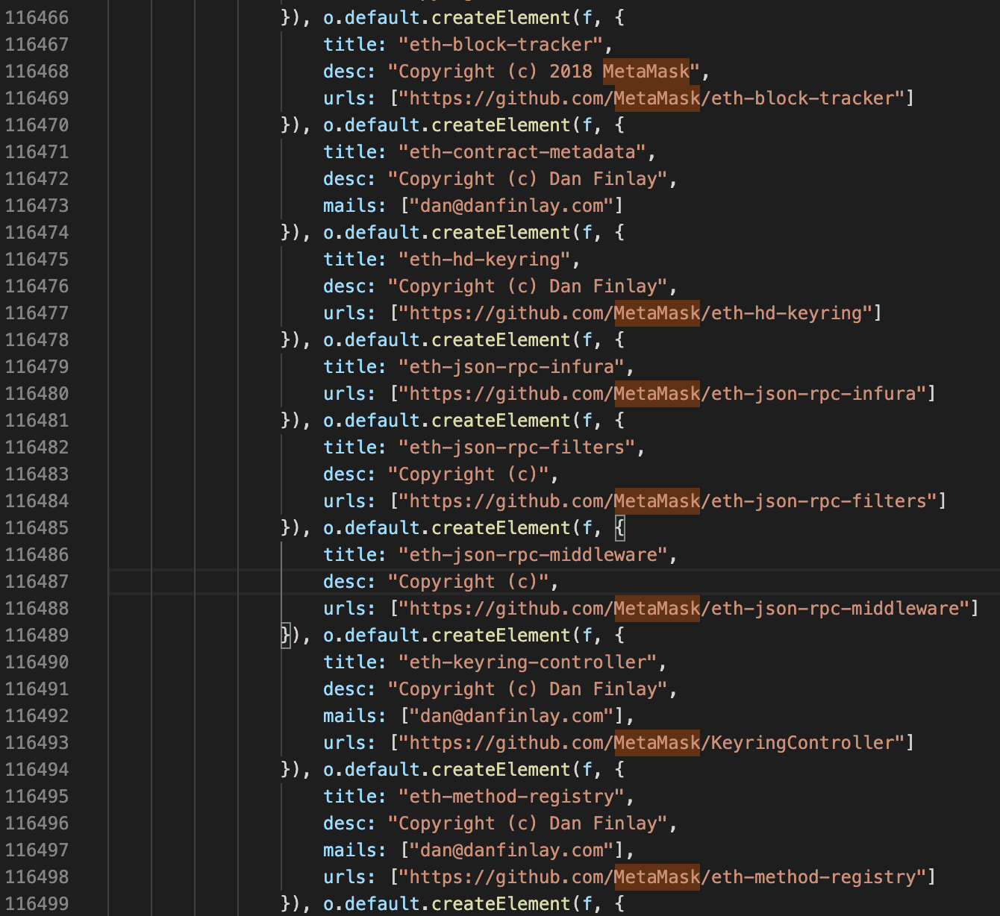
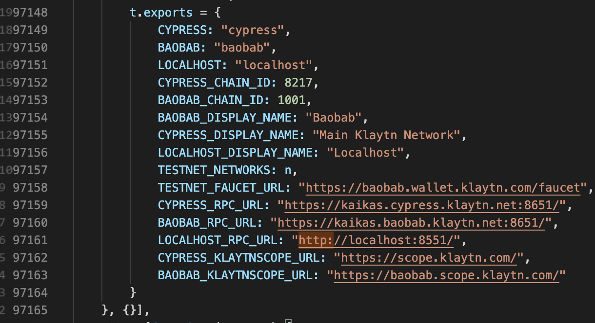
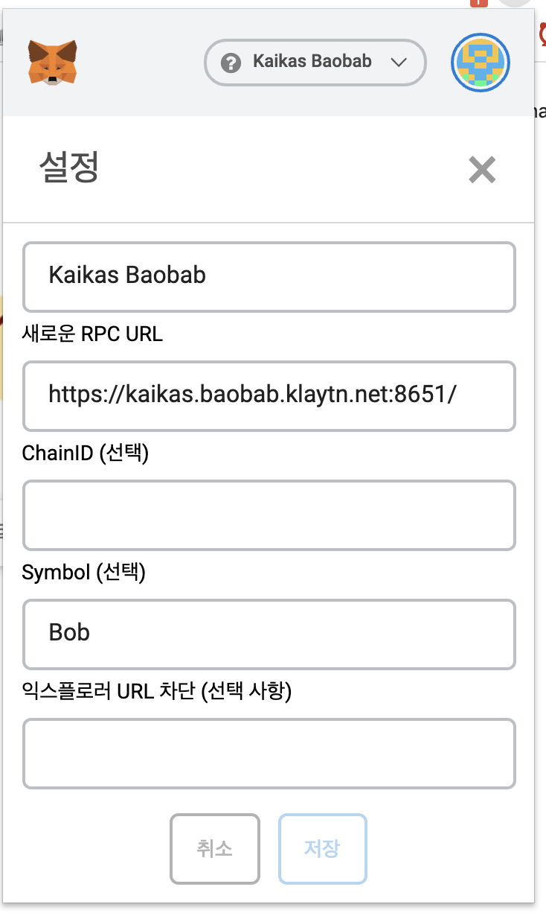
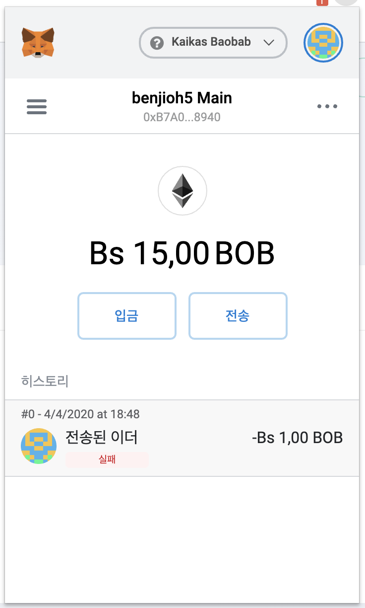
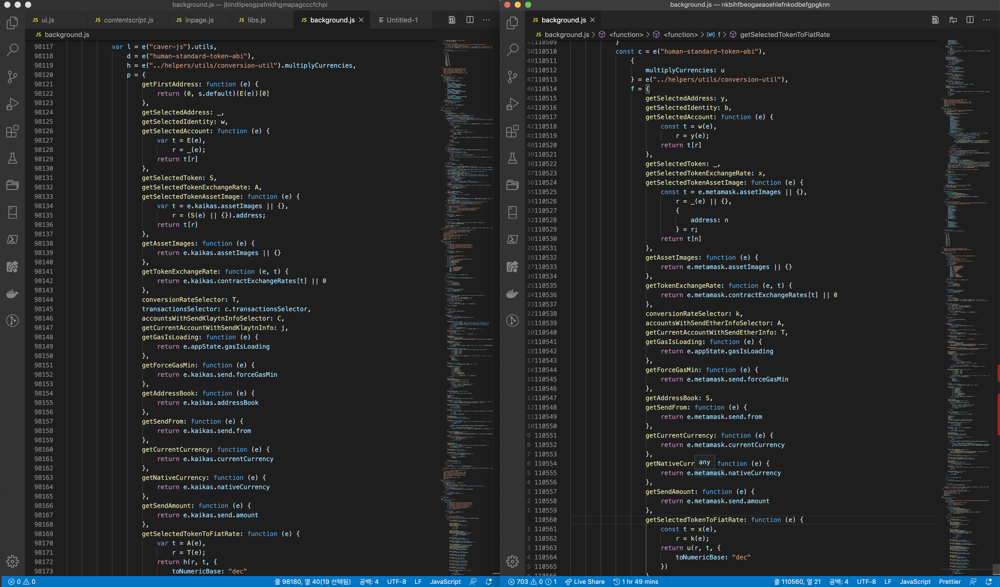

근 3개월간 블로그에 글을 적지 못할 내부적인 일과 외부적인 일이 모두 있어서, 잠시 글을 적지를 못 했는데, [Upbit 건](https://benjioh5.com/blog/upbit-hacking-tx/) 후속 글의 경우 아마 3주 내에 보고서 형태로 회사나 내 명의로 글이 나갈 예정이다. (이미 작성한 건 산더미이긴한데, 공개 가능한 부분만 추리려고 한다.)

여튼, 정신 없는 블록체인 업계 및 회사 상황은 둘째치고, 흥미를 끄는 무언가가 있어서 Kaikas 관련되서 바쁜 와중에도 글을 쓰려고 한다. 그 이유는 정말로 간단한데, 메타마스크를 갖다 배꼈으리라고 추정을 했었지만, 실제로는 좀 더 심각한 상황이었기 때문이다.

### 그래서 뭐가 심각한데?

__요약 : Kaikas는 실질적으로 메타마스크의 포크에 불과하며, 실제로 바뀐 것은 겉 모습 뿐이다.__

클레이튼은 Quorum과 같이 Go-Ethereum(Geth) 구현체의 변형이다. 실제로 많은 부분들이 Geth의 코드와 일치하고, 대부분의 코어 로직은  pBFT(Practical BFT)라는 클레이튼표 비잔티움 장애 허용 알고리즘 을 제외한 대부분의 구조는 ethereum이라는 단어가 klaytn으로 대체된 것과 별반 차이가 없다. (실제로 그래야만 하기도 하고)

Geth를 포크한 클레이튼이나 [Remix IDE]()를 [포크](https://ko.docs.klaytn.com/smart-contract/ide-and-tools/klaytn-ide)한 [Klaytn IDE]()의 경우 솔직히 사업 초창기이다 보니 이해를 할 수 있다는 느낌이긴 했고, 실제로 remix IDE의 경우 확장 플러그인이 제약적이라 플러그인 관련해서 복잡한 부분이 있었으므로 포크를 뜨는 것이 현명한 선택이었을지도 모른다.

하지만, Kaikas의 경우 이야기가 좀 많이 다른데, 

1. 일반적인 웹 기반 지갑이다. (= 상대적으로 쉽게 개발이 가능하다)
2. 메타마스크를 참고만 할 수 있었고, 코드 베이스를 새로 짜야하는 것이 옳았다.
3. UX/UI적으로 메타마스크는 불편한 편이다. (그러나 시장에서 주도적이긴 하다)
4. 솔직히 가오가 있지 이것까지 포크 뜨냐 (응?)

그래도 양심적인 것은, Kaikas 도큐멘트를 가 봤을 경우에는 [Metamask의 포크라는 것을 명시](https://docs.kaikas.io/#disclaimer)하고,  Disclaimer에 올려 놓았다는 것이다.




### 그래서 이런 경우가 존재하나?

오픈소스로 공개된 많은 블록체인 프로젝트들이 배끼고 배끼는 형태로 작동되는 것은 사실이다. 사실 배끼는 것은 중요하지 않은게 오픈소스의 특징이고, 주요한 내역들이나 개발 관련된 부분들에 있어서 이것을 가져왔다는 공지만 하면 되는 부분만 지키면 되는 것도 사실이다. kaikas의 경우 전염성이 있는 GPL이 아닌 [MIT 라이센스](https://ko.docs.klaytn.com/smart-contract/ide-and-tools/klaytn-ide)라는 약한 강제력을 갖고 있는 라이센스를 사용하고 있어서, 이런 개량한 소스코드의 공개의 문제를 빗나가기도 했다.

하지만, 실망스러운 것은 사실인데, 이러한 브라우저 확장 기반 지갑을 만드는 일은 그렇게 오래 걸릴 일이 아니기 때문이다. 그라운드 X는  작년 11월에 ["카톡 보내듯" 누구나 쓸 수 있는 가상화폐 지갑 나온다](https://www.hankyung.com/it/article/201911292373g) 라는 제목으로 기사를 내 놨다. 그리고 3월 20일에 Kaikas가 출시가 되었으니, 약 5개월 정도의 개발 기간이 최소한으로 있었을 것이다.

실 경험상 제대로 작동하는 이더리움 기반 ERC-20 지갑을 만드는 일은 약 2~3개월 정도 제로 베이스부터 시작해도 별로 문제가 없는 일이며, 실제로 자체적으로 ethers.js를 붙여서 INFURA에 연결된 지갑을 만들었을 때에 기본적인 프로토타입은 일주일 내에도 나올 정도였었다.

그런 경험상 블록체인 지갑을 포크해서 만든다는 건 이해가 되지 않는다는 것이다.

### 소스코드 드라이빙

이런 잡다한 이야기는 그만두고 핵심적인 이야기만 하자, 소스를 까 보는 것이다.

Kaikas는 오픈소스로 공개가 되어있지 않는 상태이다. 다행히도, 크롬 웹 확장 프로그램을 받아서 crx 형태로 받아진 파일을 분석을 하면 된다. 일반적으로 팩키징이 되어있지만, 뭐 Zip 파일 형태이기도 하고, 이런 분석은 진절머리나게 많이 해 봐서 단계적으로 진행을 해보려고 한다.



좌측 Kaikas, 우측 메타마스크이다. Trezor 등의 지갑 지원이 제거 된 것을 볼 수 있다. [참고로 메타마스크 깃헙 레포지토리에서 우측 구조를 확인할 수 있다.](https://github.com/MetaMask/metamask-extension/tree/develop/app/scripts)

Trezor 지원이 Kaikas에서 안된다는 것만 확인했으니 약간 실망을 하고 (?) 제대로 소스코드를 까보자.

제일 먼저 해볼 것은 소스코드에 Metamask가 있는가이다.



좌측에 github.com/ 로 시작되는 Metamask 참조가 대량으로 발견된다.

좌측 파일 연 것을 보면 Javascript 관련 팩킹이 되어있으므로, 일단 코드는 싹 다 난독화되어있다. 부로 그런건 아니고,  Javascript 로딩 속도를 빠르게 하기 위한 꼼수들이고, 실제로 사람이 읽기 편한 코드 보다는 컴퓨터가 쓰기 편한 코드로 만드는게 낫긴하니... 프로덕션 배포시에는 이렇게 배포를 한다.

여튼, 문제는 팩킹이 되어있으므로 분석이 힘들다는 것이다. 개발자들도 사람이니, 이런 팩킹을 푸는 언패커를 개발해 놨고, 가져다 쓰면 된다. e.g. [언패커](https://www.strictly-software.com/unpacker#unpacker) / [de4js](https://lelinhtinh.github.io/de4js/)

팩킹을 풀어보니 다음과 같이 나온다. Metamask를 갖다 쓴 건 확실해보인다.



메타마스크가 갖고 있는 주요 기능을 구현하기 위한 모듈들이 박힌것을 확인 할 수 있다. (블록 트래커, hd키 관련 라이브러라, JSON-RPC 라이브러리 등)

뭐 재미있는게 있나 없나, 뒤적거리시 시작 했는데, background.js에서 재미있는게 많이 걸린다.

디컴파일 된 56282라인에는 재미있는 것을 볼 수 있는데, ethjs를 통해서 네트워크 연결을 한다는 것이고, INFURA를 통한 이더리움  ropsten 테스트넷 연결을 하는 코드 일부분이 남아있다는 것(...)이다.

```javascript
        function i(e, t) {
            if (!(this instanceof i)) throw new Error('[ethjs-provider-http] the HttpProvider instance requires the "new" flag in order to function normally (e.g. `const eth = new Eth(new HttpProvider());`).');
            if ("string" != typeof e) throw new Error('[ethjs-provider-http] the HttpProvider instance requires that the host be specified (e.g. `new HttpProvider("http://localhost:8545")` or via service like infura `new HttpProvider("http://ropsten.infura.io")`)');
            this.host = e, this.timeout = t || 0
        }
```

또한, Eth-contracet-registry 관련한 파트도 코드가 남아있은 것을 볼 수 있다. reqistry-map.json을 가져와서 박아넣으니 보일리는 없지만, 좀 웃긴 코드가 되어버렸다.

```javascript
        const n = e("ethjs"),
            i = e("./registry-map.json"),
            o = e("./abi");
        t.exports = class {
          constructor(e = {}) {
                this.provider = e.provider || new n.HttpProvider("https://mainnet.infura.io/eth-contract-registry"), this.eth = new n(this.provider);
                const t = i[e.network || "1"];
                if (!t) throw new Error("No method registry found on the requested network.");
                this.registry = this.eth.contract(o).at(t)
            }
```

둘째로,  Kaikas JSON-RPC 통신용 전용 포트가 잡혔다.



```javascript
    1234: [function (e, t, r) {
        "use strict";
        var n = [1001];
        t.exports = {
            CYPRESS: "cypress",
            BAOBAB: "baobab",
            LOCALHOST: "localhost",
            CYPRESS_CHAIN_ID: 8217,
            BAOBAB_CHAIN_ID: 1001,
            BAOBAB_DISPLAY_NAME: "Baobab",
            CYPRESS_DISPLAY_NAME: "Main Klaytn Network",
            LOCALHOST_DISPLAY_NAME: "Localhost",
            TESTNET_NETWORKS: n,
            TESTNET_FAUCET_URL: "https://baobab.wallet.klaytn.com/faucet",
            CYPRESS_RPC_URL: "https://kaikas.cypress.klaytn.net:8651/",
            BAOBAB_RPC_URL: "https://kaikas.baobab.klaytn.net:8651/",
            LOCALHOST_RPC_URL: "http://localhost:8551/",
            CYPRESS_KLAYTNSCOPE_URL: "https://scope.klaytn.com/",
            BAOBAB_KLAYTNSCOPE_URL: "https://baobab.scope.klaytn.com/"
        }
    }, {}],
```

별건 아닌데,  (Metamak와 호환되는) Ethereum JSON-RPC 포크이고, 네트워크에 접속 규격이 같을테니 Metamask에 이 정보를 등록하면 클레이튼 네트워크에 Kaikas처럼 접근이 가능할 것이다. 실제로 해보니 전송의 경우 제약이 좀 있었고, 입금은 Metamask에서 정상적으로 잘 된다.

1. [Tx 정보](https://baobab.scope.klaytn.com/tx/0x32e7a0e1d4a017ed9b927eeb0da9474cb84ee04311e45e5dad8537c790263b84)





여튼 연동되는 것을 확인했으니  RPC 파트는 넘어가도록 하자.

셋째로, 많은 부분에서 caver-js가 아닌 ethjs를 사용하는 것을 확인할 수 있다. Caver로 전환을 시도한 흔적들이 많이 보이나, 한계가 명확하게 보이고 background.js에서 일부 수정한 것 제외하고는 ui.js 등에서는 ethjs를 걷어내는 것에 실패한 것으로 보인다. (참고로 ethjs는 ethereumtx-js의 줄임말로 Metamask가 사용하는 이더리움 라이브러리 이름이다)

```javascript
            function b(e, t) {
                if (0 !== e.length && e.length < t + 32) throw new Error("[ethjs-abi] while decoding dynamic bytes data, invalid bytes length: " + e.length + " should be less than " + (t + 32));
                var n = f.decode(e, t).value;
                if (n = n.toNumber(), 0 !== e.length && e.length < t + 32 + n) throw new Error("[ethjs-abi] while decoding dynamic bytes data, invalid bytes length: " + e.length + " should be less than " + (t + 32 + n));
                return {
                    consumed: parseInt(32 + 32 * Math.ceil(n / 32), 10),
                    value: e.slice(t + 32, t + 32 + n)
                }
            }
```

동일하게 ethjs의 다른 라이브러리도 사용하게 되는데,

```javascript
    }, {
        "./contract": 702,
        "./has-tx-object": 703,
        "babel-runtime/core-js/object/assign": 254,
        "ethjs-abi": 705,
        "ethjs-filter": 707,
        "ethjs-util": 710,
        "js-sha3": 711
    }],
```

ABI와 Filter, uitl도 가져다 쓰는 것을 확인할 수 있다.

유사 코드들을 분석하는 건 눈 diff (눈으로 차이점 확인 (...))이 제일 뇌가 편하긴 하다. 일단 이런식으로 차이가 별로 안나는 부분들을 확인할 수 있다.



 kaikas vs metamask (...)

사실 코드 유사도에 대한 분석의 경우 유사도 분석 툴이 따로 있고, 이것을 이용하여 분석을 하는 것을 더 권장한다. 사실 프로그래머 입장에서 수 만 라인 단위의 코드를 분석하는 것은 말처럼 쉽지도 않고, 변경점을 찾아내는 것도 눈으로 diff 뜨는게 쉬운 일도 아니기 때문이다. (사실 다 프로그래머 하는 일이 귀찮아서 그런거지 ㅠㅠ)

[Moss](https://theory.stanford.edu/~aiken/moss/)가 일단 대안이 될 수 있을 것이다. Moss는 스탠포드에서 학생 과제 배낀 것을 찾아내기 위해 만든 유사도 측정 시스템이다. 하지만, 가입 절차가 까다로운 편이고, 이런 그래프 기반 분석 도구를 써야하는 것은 솔직히 들인 돈과 수고에 비해서 얻는게 별 거 없는 결과가 될 것이 분명하므로 그냥 넘어가도록 하겠다. (이 글 작성만 4~5시간이 걸렸는데 더 적어봤자 의미도 없다.)

### 결론

Kaikas는 클레이튼맛 메타마크스라고 할 수 있다. 좀 더 정확히 말하면 Kaikas는 메타마스크 기반 클레이튼 지갑인데, 사실 코드를 뜯어고친 것을 보면 실제로 코드에 대한 이해나 핵심 코어 로직에 대한 이해가 낮은 상태로 핵심 로직만 클레이튼에 맞게 고친 것으로 보인다.

많은 부분들이 바뀐 것을 확인하였으나, 핵심적인 노드 통신 로직은 변경이 안 된 것으로 보인다. 몇몇 부분에 있어서 클레이튼의 대납 기능과 트랜젝션 구조체 변경은 caver-js를 일부 임포트해와서 사용하는 것으로 갈음 한 것으로 보인다.

특이한 점은,  contentscript.js가 팩킹이 2중으로 되어있다는 건데, 아마도 핵심 로직을 감추고 싶어하는 부분이 있어서 그런 것으로 추정이 된다.

여튼, 뭐 Kaikas는 실망감을 너무 많이 주는 예시가 아닌가 싶다. 실제로 코드를 가져왔으면, 레포라도 공개를 좀 해줘야하는게 아닌가 싶고, 솔직히 코어 로직 변경이 안 된 부분들이 눈에 띄는 것들은 차차 수정이 되겠지만, 실제로 이런식으로 날림 런칭은 자제 해야하지 않나 싶다.

### 주의 사항

팩킹 문제도 있고 해서, 모든 코드를 읽지를 못 했다. (한 10~20% 정도라는게 맞을 것이다.) 실제로 양이 너무 많고, 대부분 유사도 검색이나 리버싱하던 감으로 찍어서 찾아낸 부분들이 대부분이라서 실제로 개발이 더 되어있거나 필요하지 않은 부분까지 다르다고 할 수는 있다.

추가적으로 Metamask는 최신 버전으로, Kaikas는 1.0.2 버전을 사용해서 분석을 하였고, Kaikas는 Metamask 구 버전 코드를 가져다 쓴 것으로 파악되고 있다. (팩킹 스타일이 다름) 이 부분에 대해서는 포크를 뜬 코드를 찾아서 그 코드로 분석을 때리면 제일 편하겠지만, 솔직히 그럴 시간도 없고 할 가치도 없어 보여서 그냥 넘어갔다.