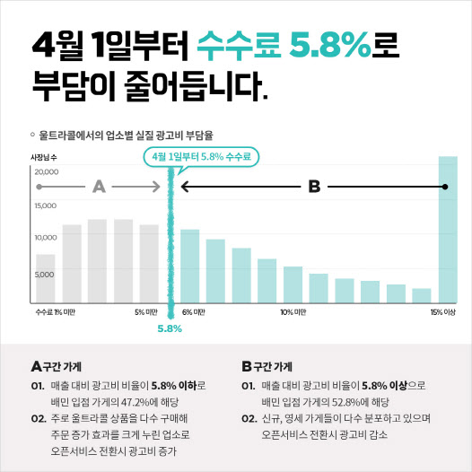
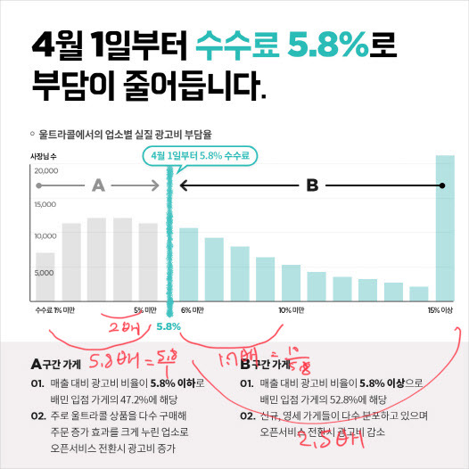
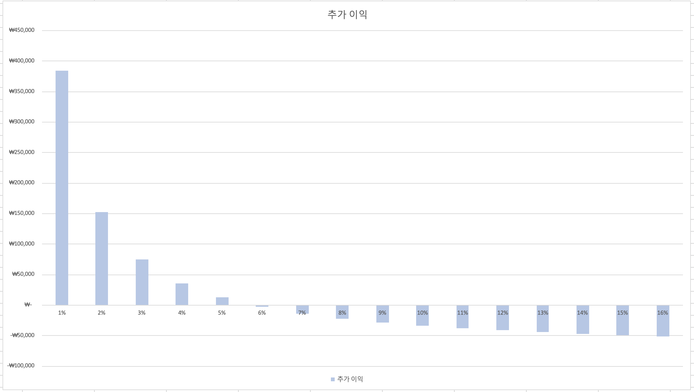

[저번 글](https://benjioh5.com/blog/share-economy-1-baemin/)에서 이야기 된 부분들에 이어서 배달의 민족의 통계 장난에 대해서 이야기를 해보려고 한다. 사실 실명 까 놓고 이야기해야하나 싶지만, 여튼 뭐 일단 재미있는 이야기이기도하고, 실제로 자주 보이는 마케팅 대형 실패 사례가 아닌가라는 느낌을 지울 수 없기에 일단 플랫폼 이야기의 연작으로 적기로 하였다.



사건의 발단은 다음과 같다.

1. [[심재석의 입장] 배달의민족 수수료 기사 작성법](https://byline.network/2020/04/6-51/)
2. [배민 오픈서비스, 혁신, 그리고 내 피같은 세금](https://brunch.co.kr/@brunchjqcb/179)

이 두 글을 읽으면서, 든 궁금점이 몇 가지가 있었는데, 사실 이 그래프를 보면 딱 하고 아 이거 사기치는거구나라는 생각을 해야하는데, 이걸 자랑스럽게 인용을 했다는 것이다. 그리고, 대부분의 배민을 옹호하는 기사들은 52.8%에 해당하는 점주들이 이익을 보니 실제로는 괜찮다는 글을 쓰고 있는데, 솔직히 통계 교육이 얼마나 절신한가에 대해서 잠시 생각해볼만했다.

여튼, 위의 그래프는 B라는 넓은 면적의 업주들이 이익을 보는 것처럼 보인다. 그리고 그래프의 설명에도 52.8%가 이익을 보고 47.2%가 손해를 보는 반은 이익을 보고 반은 손해를 보는 형태라는 것을 알 수 있다. 하지만, 여기서 드는 의문은 이것이다. 반은 얼마나 손해를 보고, 반은 얼마나 이익을 보는 것인가?

제일 쉬운 방법은 기존 수수료 나누기 신규 수수료 (5.8%)를 해보는 것이다.



여기서부터, 어? 라는 모멘트가 올 것이다.

수수료 1%를 내던 업주는 5.8%(5.8배 증가)로 올라가게 되고,
수수료 10%를 내던 업주는 5.8%(1.7배 감소)로 내려가게 되는데,
여기서... 10%와 1%의 간격은 같다.

로그스케일로 그렸어야했었는데, 사람들이 로그 스케일하면 이해를 못 할 것이라고 생각하고 이렇게 1%씩 딱딱 나눠서 그렸을 가능성도 있다. 하지만, 16% 이상은 또 따로 뭉쳐 놓은 것을 보면 그래프를 어떻게 만져야하는지를 알고 있는 사람이라는 것은 분명하다. 가중치를 생각한다면 이것은 다분히 고의적이었다는 것을 알 수 있다.

실제로는 각 퍼센트별로 울트라콜 1건당 더 물게 되는 수수료 금액의 그래프는 다음과 같이 그려진다.



1% 대의 경우 엄청나게 (...) 더 수수료를 물고, 5% 이후부터는 5~6 만원 정도의 절감 효과 (울트라콜 가격이 8만원이라는 걸 생각해보자!)를 얻을 수 있는 것을 볼 수 있다. 실제로 57%가 이득을 보건 말건간데, 일정 수준 이상의 이익을 보는 업주들은 싹 다 곱절로 자부담금이 높아지는 형태이다.

### 좀 더 생각해보기

"울트라콜에서의 업소별 실질 광고비 부담률"이란 무엇인가? 부터 생각을 해봐야할 것이다. 실질 부담률의 경우 단순하게 계산을 할 수 있다.

```
 실질 부담률 = 울트라콜 비용 / 가게 전체 매출액 
```

즉, 우리는 울트라콜 비용을 알게 된다면, 가게 전체 매출액을 역산할 수 있는 것이다.

```
 가게 전체 매출액 = 울트라콜 비용 / 실질 부담률
```

일반적으로 울트라콜은 월 8만원 (부가세 별도)이고, 일반적으로 울트라콜은 1개에서 많으면 10개까지 일반적으로 등록하는 편이다. 우리는 일단 1개를 등록한다고 가정을 하자. 그러면, __최소__ 월 800씩 버는 가게들이 약 7500 군데 있다는 것을 알 수 있다. (실질 부담률 1%짜리에 약 7500 가게 정도가 있다고 그래프에 적혀있다.)

__해명을 하기 위해서 공개한 자료가 가게 매출 데이터를 까발려버린 것이다__

그렇다면, 가게 갯수도 아는 시점(그래프에 넣어놨다)에서 그냥 이걸로 역산을 하면, 5.8% 수수료 정책을 통해서 얻을 수 있는 최소한의 기대값을 알 수 있을 것이다. 이를 표로 만들어보자.

|              | 1%              | 2%              | 3%             | 4%             | 5%             | 6%              | 7%              | 8%              | 9%              | 10%             | 11%             | 12%             | 13%             | 14%             | 15%             | 16%              |
| ------------ | --------------- | --------------- | -------------- | -------------- | -------------- | --------------- | --------------- | --------------- | --------------- | --------------- | --------------- | --------------- | --------------- | --------------- | --------------- | ---------------- |
| 개선 수수료  | 0.058           | 0.058           | 0.058          | 0.058          | 0.058          | 0.058           | 0.058           | 0.058           | 0.058           | 0.058           | 0.058           | 0.058           | 0.058           | 0.058           | 0.058           | 0.058            |
| 기존 수수료  | 0.01            | 0.02            | 0.03           | 0.04           | 0.05           | 0.06            | 0.07            | 0.08            | 0.09            | 0.1             | 0.11            | 0.12            | 0.13            | 0.14            | 0.15            | 0.16             |
| 배율         | 5.8             | 2.9             | 1.933333333    | 1.45           | 1.16           | 0.966666667     | 0.828571429     | 0.725           | 0.644444444     | 0.58            | 0.527272727     | 0.483333333     | 0.446153846     | 0.414285714     | 0.386666667     | 0.3625           |
| 기존 광고비  | ₩      80,000   | ₩      80,000   | ₩      80,000  | ₩      80,000  | ₩      80,000  | ₩      80,000   | ₩      80,000   | ₩      80,000   | ₩      80,000   | ₩      80,000   | ₩      80,000   | ₩      80,000   | ₩      80,000   | ₩      80,000   | ₩      80,000   | ₩      80,000    |
| 개선 광고비  | ₩     464,000   | ₩     232,000   | ₩     154,667  | ₩     116,000  | ₩      92,800  | ₩      77,333   | ₩      66,286   | ₩      58,000   | ₩      51,556   | ₩      46,400   | ₩      42,182   | ₩      38,667   | ₩      35,692   | ₩      33,143   | ₩      30,933   | ₩      29,000    |
| 추가 이익    | ₩     384,000   | ₩     152,000   | ₩      74,667  | ₩      36,000  | ₩      12,800  | -₩       2,667  | -₩      13,714  | -₩      22,000  | -₩      28,444  | -₩      33,600  | -₩      37,818  | -₩      41,333  | -₩      44,308  | -₩      46,857  | -₩      49,067  | -₩      51,000   |
| 해당 가게 수 | 7500            | 12000           | 13000          | 12500          | 12000          | 11000           | 9000            | 8000            | 7500            | 6000            | 5500            | 4000            | 3000            | 2500            | 2000            | 22000            |
| 구간별 이익  | ₩ 2,880,000,000 | ₩ 1,824,000,000 | ₩  970,666,667 | ₩  450,000,000 | ₩  153,600,000 | -₩   29,333,333 | -₩  123,428,571 | -₩  176,000,000 | -₩  213,333,333 | -₩  201,600,000 | -₩  208,000,000 | -₩  165,333,333 | -₩  132,923,077 | -₩  117,142,857 | -₩   98,133,333 | -₩ 1,122,000,000 |

울트라콜 1회 8만원/월이라는 조건으로 잡았고, 울트라콜을 n번 했다면 다 n 번 곱해주면 된다.

여튼, 결과적으로 배민은 약 36억/월, 440억/월 정도의 추가적인 중개 수수료를 얻을 수 있게 된다. 울트라콜을 1번만 결제한다는 가정아래서 말이다. 3번이면? 3배해서 1320억/년 수익이 추가 된다. 멋지지 않은가?ㄴ

### 근데 왜 하필 5.8%?

왜 하필 5.8%인가? 라고 하면 50:50으로 나뉘어지는 1대1 가르마.... 이기 때문인건 아니고,  최빈값이나 평균값을 선택하면, 최대의 이익을 뽑아낼 수 있다는 (...) 것을 통계를 배웠다면 바로 알 수 있을 것이다. 5%도 아니고 6%도 아닌 5.8%가 뙇하고 나온 것은 통계를 낸 뒤 배달의 민족 수수료를 물었는 경우 최대 수익이 나는 지점을 잡았을 가능성이 큰 것이다.

사실 이 정도까지 나왔으면, 배달의 민족은 상생이라는 단어나 업주들과 같이 갈 생각은 충분히 없어보인다는 것도 사실일 것이다. 대충 과점 시장이 되었고, 과점 시장에서도 제1위를 하고 있는 시점에서 이렇게 노골적으로 가격 정책을 바꾼 것을 봤을 때에는 말이다.

### 더 생각할 것

1. 일반적으로 10% 이상의 실질 광고부담률을 갖고 있는 가게들은 두 종류로 나뉘어질 가능성이 크다. 월 2~300만원 미만의 배달 매출을 내고 있거나, 경쟁이 박터지는 곳에 있어 울트라콜을 10개 이상 박아넣고 중간 정도의 매출과 대량의 광고비를 쓰는 점주이다.

2. 15% 이상이 2.2만 곳으로 잡혔다. 데이터를 편집한것인데, 그래프 모양을 보면 바이노미얼인거 같지는 않고, (이 경우 데이터를 분석해봐야지만) 실제로 푸아송 그래프를 따를 가능성이 높다. 핏팅은 귀찮아서 안 했다. (그리고 5.8%가 약간 오른쪽으로 치우쳐진 이유가 푸아송 그래프에서 평균값이 약간 오른쪽에 놓여지기 떄문일 것이다.)

3. 그 외 몫 좋은 곳에 자리를 잡은 경우 1%~3% 대 정도의 수수료를 내고, 꽤 벌고 있다는 것을 알 수 있다. 배달의 민족이 갖고 있었던 이점이라고 하면 할 수 있을 것이다. (울트라콜 1번 박아서도 최소 240만원/월에서 800만원/월을 벌고 있는 것이다. 3개를 박으면 무려 720만원/월에서 2400만원/월이다!) 
   1. 배달의 민족이 노리는 타겟들도 이 쪽일 가능성이 크다. 실제로 2배에서 5.8배 정도 수수료를 더 무는 구간이 이 부분이다.
4. 회귀 분석을 해야할 필요가 있어보인다. 일단 그래프상으로 나올 수 있는 제일 보수적인 수치를 잡아서 단일 모델로 잡았는데, 이 부분은 누군가가 대신 해주리라고 믿고 있다.
   1. 울트라콜 갯수에 따라서 10개 정도의 그룹으로 나눠서 분석을 하면 대충 뭐가 나오리라고 생각하고 있다.

### 좀 더 생각해볼 수도 있는 것

1. 그렇다면, 왜 배달의 민족은 일부 손해를 충분히 감수를 하고 있는 것인가? 5.8% 이상의 수수료를 물고 있는 가게는 그냥 5.8% 이상 물게 냅두면 안되는 것인가?
   1. 일반적으로 신규 가게는 매출이 떨어지게 되어있고, 8만원씩 울트라콜을 긁을 가능성이 크다. 즉, 신규 업장이 성숙화 되면 매출이 증대하고, 그래프의 좌측으로 넘어갈 것이다.
   2. 매출에 따라서 0원부터 시작하는 것과 8만원부터 고정비를 지급하는 것은 체감이 다르다.

결론은 이미 난 게 아닌가 싶다. 반박은 언제나 환영하고, 댓글로 링크를 부탁드린다.

-- 다음 편에 계속 --